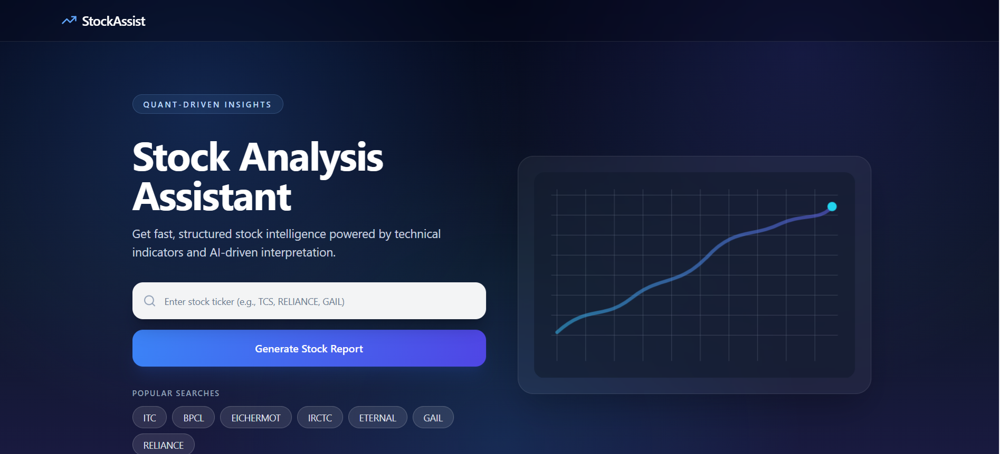
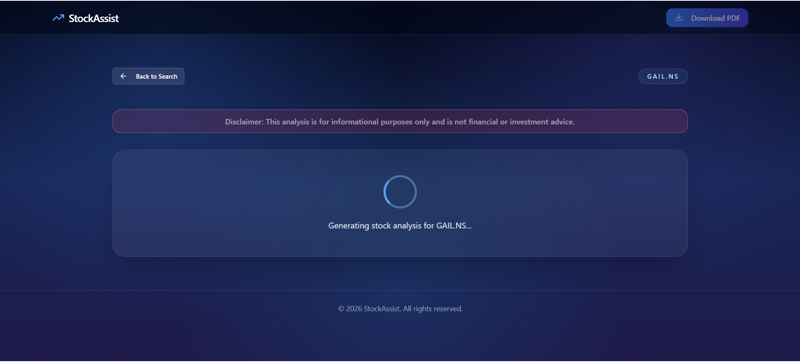
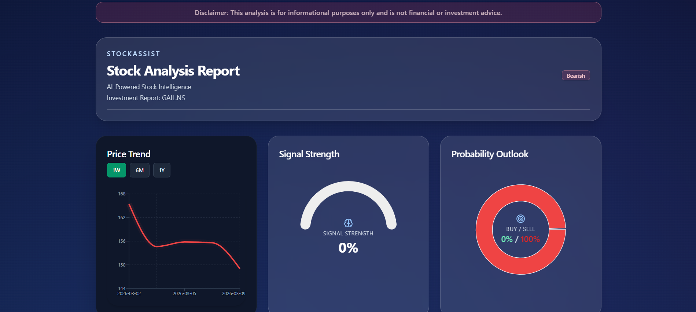
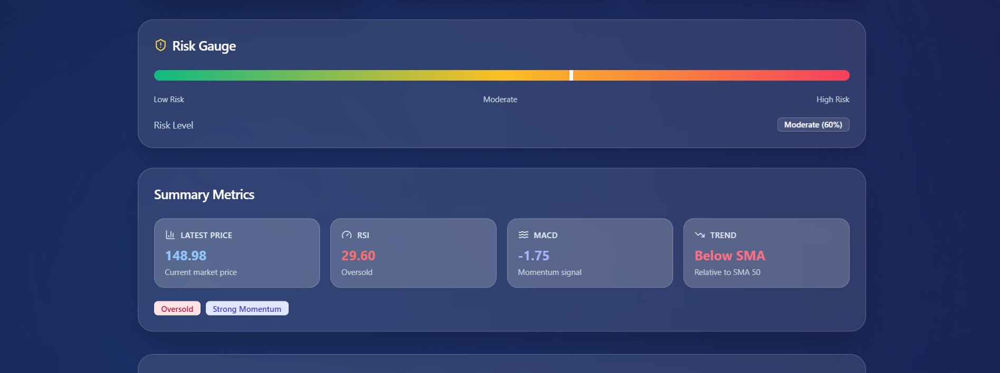
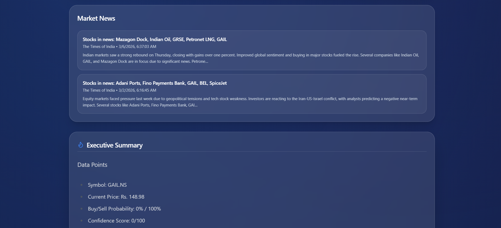
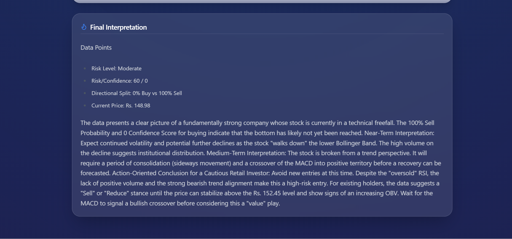

# Stock Assistant

AI-powered stock analysis assistant with a Next.js frontend and a FastAPI backend.

The app combines technical indicators, fundamentals, market news, and deterministic scoring, then adds AI narrative interpretation in a fixed report structure.

## Current Functionality

- Search by ticker symbol from the landing page and generate a full report at `frontend/app/results/page.tsx`.
- Indian market symbol fallback in backend: tries raw symbol, then `.NS`, then `.BO`.
- Structured 7-part analysis output:
  - Executive Summary
  - Trend Position
  - Momentum Signals
  - Volatility & Risk Context
  - Fundamentals Snapshot
  - Bullish Case vs Bearish Case
  - Final Interpretation
- Deterministic `risk_score`, `confidence_score`, `buy_probability`, and `sell_probability` computed server-side.
- AI explanation generated from computed metrics only (no free-form number invention).
- Analysis section normalization and fallback report generation when model output is missing or malformed.
- Multi-timeframe chart refresh via API query range support (`1d`, `1w`, `1m`, `6m`, `1y`).
- Result page chart controls currently use `1W`, `6M`, and `1Y`.
- News enrichment with relevance filtering and Yahoo Finance fallback.
- PDF export of the report UI.
- In-memory caching and degraded-mode fallback when upstream providers are rate-limited.

## Project Images

Keep project screenshots in `docs/images/`.

Current placeholders:

- `docs/images/landing-page-placeholder.svg`
- `docs/images/results-page-placeholder.svg`
- `docs/images/report-export-placeholder.svg`

Preview in README:

### Landing Page



### Results Page







### Report Export


Drive link placeholder: [View Exported Report (Google Drive)](https://drive.google.com/file/d/1jMj5pJS6CXtr6Sj0vO5DsbyP1w8bFnC6/view?usp=sharing)


## Key Decisions Taken

- Deterministic scoring + AI narrative: the backend calculates all critical numeric signals, and Gemini is used only for explanation. This reduces hallucination risk in investment-facing output.
- Enforced report schema: analysis is normalized into the same 7 sections every time, so frontend rendering stays stable.
- Graceful degradation first: when providers fail or rate-limit, API can return cached analysis instead of hard failure.
- API proxy in Next.js: frontend never calls the Python service directly from the browser; `frontend/app/api/stock/[ticker]/route.ts` centralizes backend access.
- Environment-based backend URL: proxy supports `BACKEND_URL` / `NEXT_PUBLIC_BACKEND_URL` for deployment flexibility.
- Fast chart refresh path: requests with `range` return lightweight chart data only, avoiding full analysis recomputation.
- Relevance-over-volume news strategy: strict relevance filters are applied before showing articles.

## Tech Stack

### Frontend

- Next.js 15 (App Router)
- React 19 + TypeScript
- Tailwind CSS
- Recharts
- Lucide React
- html2canvas + jsPDF

### Backend

- FastAPI + Uvicorn
- yfinance
- pandas + pandas-ta
- google-genai
- httpx
- python-dotenv

## Project Structure

```text
bot/
├─ docs/
│  └─ images/
│     ├─ landing-page-placeholder.svg
│     ├─ results-page-placeholder.svg
│     └─ report-export-placeholder.svg
├─ backend/
│  ├─ main.py
│  ├─ requirements.txt
│  └─ runtime.txt
├─ frontend/
│  ├─ app/
│  │  ├─ page.tsx
│  │  ├─ results/page.tsx
│  │  └─ api/stock/[ticker]/route.ts
│  ├─ components/
│  └─ package.json
└─ README.md
```

## Prerequisites

- Node.js `>=20.19.0`
- npm
- Python 3.10+
- Gemini API key
- News API key

## Environment Variables

Create `backend/.env`:

```env
GEMINI_API_KEY=your_gemini_api_key
NEWS_API_KEY=your_news_api_key
```

Optional frontend env values (recommended for deployment):

```env
BACKEND_URL=http://127.0.0.1:8000
# or
NEXT_PUBLIC_BACKEND_URL=http://127.0.0.1:8000
```

## Setup

### Backend

```bash
cd backend
python -m venv .venv
# Windows PowerShell
.\.venv\Scripts\Activate.ps1
pip install -r requirements.txt
python main.py
```

Backend runs on `http://127.0.0.1:8000`.

### Frontend

```bash
cd frontend
npm install
npm run dev
```

Frontend runs on `http://localhost:3000`.

## API Overview

- `GET /health`: health check endpoint.
- `GET /api/stock/{ticker_symbol}`: returns full analysis payload.
- `GET /api/stock/{ticker_symbol}?range=1d|1w|1m|6m|1y`: returns chart refresh payload (`chartData`).

Response payload can include:

- `scores`
- `indicators`
- `analysis_text`
- `analysis_sections`
- `news`
- `chartData`
- `warning` (when cached fallback is used)
- `error` (when request cannot be fulfilled)

## Frontend Scripts

From `frontend/`:

- `npm run dev`
- `npm run build`
- `npm run start`
- `npm run lint`

## Troubleshooting

- Missing API keys: verify `backend/.env` contains both keys.
- 503 from frontend API route: check backend is running and `BACKEND_URL` is correct.
- CORS issues: update `allow_origins` in `backend/main.py` for your frontend origin.
- Empty or delayed results: upstream rate-limits can trigger cached fallback behavior.

## Disclaimer

For educational and informational purposes only. This project does not constitute financial advice.
